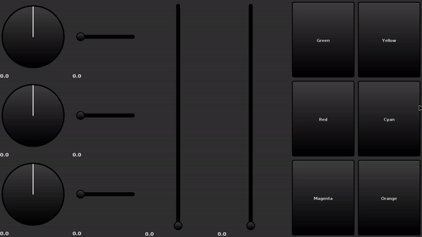

## Pixez Surface

Pixez Surface is an AWT control surface library that provides 
a set of simple components for use in other Pixez-based project.

### Current Demonstration

### Currently Implemented Components
- Knobs
- Sliders
- Buttons

### Planned Components
- Switches
- Scrollbars
- Counters
- Rollers
- Combo Boxes
